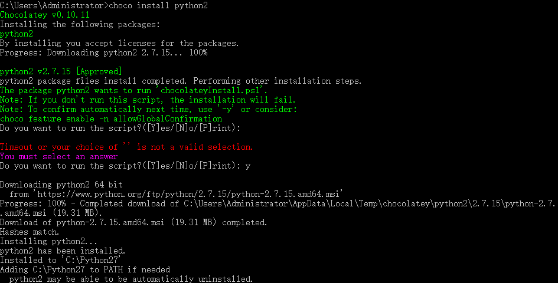
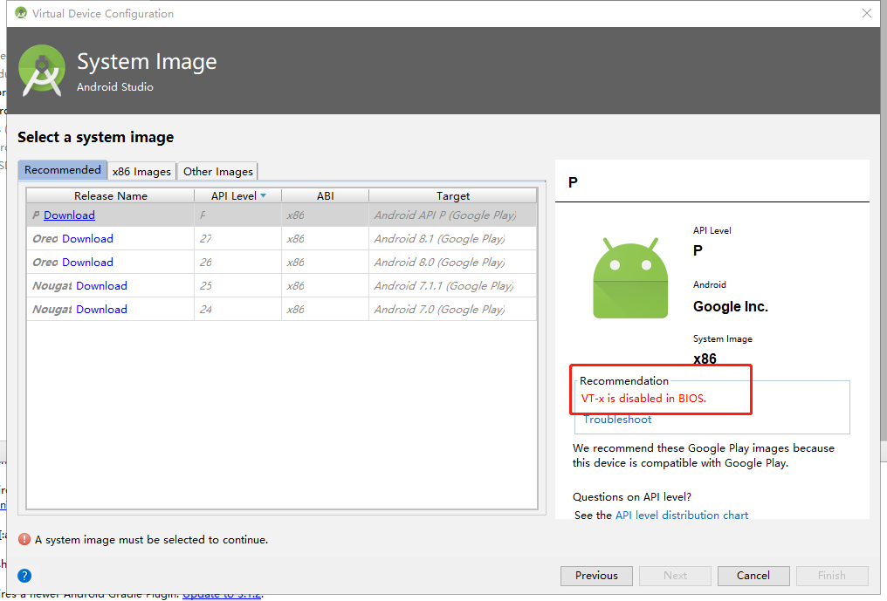
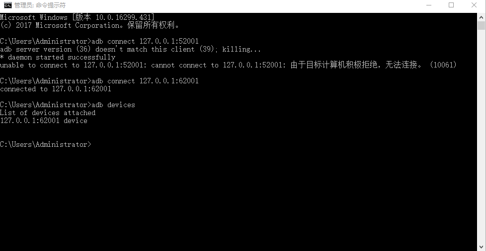
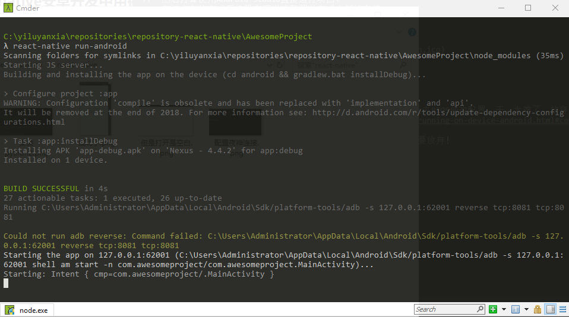
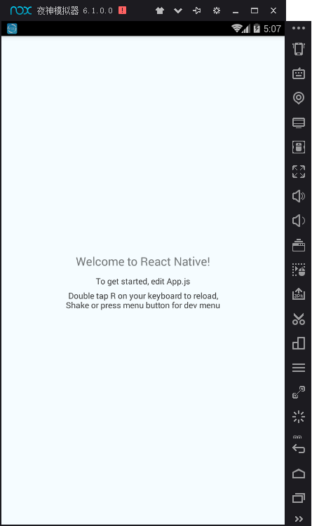
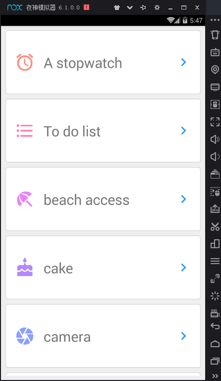

## 前置工作
[react-native官方文档](http://facebook.github.io/react-native/docs/getting-started.html)  
[react-native中文文档](https://reactnative.cn/docs/0.51/getting-started.html#python-2)

### （一）安装必需的软件 

1. Chocolatey

[Chocolatey](https://chocolatey.org/install)的官网


使用管理员打开cmd,输入
```
@"%SystemRoot%\System32\WindowsPowerShell\v1.0\powershell.exe" -NoProfile -InputFormat None -ExecutionPolicy Bypass -Command "iex ((New-Object System.Net.WebClient).DownloadString('https://chocolatey.org/install.ps1'))" && SET "PATH=%PATH%;%ALLUSERSPROFILE%\chocolatey\bin"
```
2. 安装Python 2
 
在cmd中输入

```
choco install python2
```


输入y,不要直接回车。

3. 安装node

```
choco install  nodejs.install 
```
在此之前我已经用nvm安装过node了。

4. 安装jdk8

```
choco install jdk8

```
在此之前我已经去官网下载jdk了。
注意：jdk版本需为8。

5. 安装Yarn、React Native的命令行工具

```
npm install -g yarn react-native-cli
```

设置镜像源
```
yarn config set registry https://registry.npm.taobao.org --global
yarn config set disturl https://npm.taobao.org/dist --global
```

6. 安装Android Studio/夜神模拟器  
这一步是为了使用其模拟器，实际上可忽略。
因为我在使用Android Studio的过程中遇到对我来说非常困难的bug
然后我就放弃了  
所以我又安装了夜神模拟器，虽然使用这个模拟器也遇到问题

7. 初始化项目

```
react-native init AwesomeProject
cd AwesomeProject
react-native run-android
```
然后bug就来了，出现红色的提示  
<!--  -->

我的理解就是模拟器没有关联并启动所导致的。（可能是错误的）


### （二）在模拟器中运行 

然后打算使用Android Studio直接运行项目。
在初步安装完成后按照官网进行配置以完成全部的安装。
打开已存在的项目，注意选择的是项目下的Android文件夹
稍等几分钟运行按钮由灰色变成绿色



原因是 “Vt-x is disabled in BIOS”

遇到问题，首先是想到伟大的网友们。

谷歌搜索到的答案，是手动安装“intelhaxm-android.exe”，然后去BIOS修改配置，天，太难了，放弃！
然后决定[在设备上运行](https://reactnative.cn/docs/0.51/running-on-device-android.html#content)
好麻烦，放弃！
于是安装夜神模拟器，结果还是遇到问题了，心想，再困难也不要放弃！

[详细的步骤](https://www.yeshen.com/blog/reactnativeyeshen/)
1. 打开夜神模拟器
2. 连接模拟器
输入此命令连接模拟器
```
adb connect 127.0.0.1:62001
```

3. 查看是否有连接设备

```
adb devices

```



4. 运行项目
进入到项目，执行命令

```
 react-native run-android
```


5. 解决夜神模拟器红屏  
这时夜神模拟器出现刺眼的红屏  
点击“摇一摇”按钮，在弹出菜单中选择"Dev Settings",点击Debug,输入自己的ip地址和8081

```
192.168.0.xxx:8081
```
6. 关闭模拟器重新执行以上步骤
噔噔噔噔！  
  
终于出来了！  


## 实践
### （一）FlatList长列表

根据官方文档的实例，布局还是挺容易的，不过内置的属性和方法，还没有更深入的体验，这对我来说还有一定的难度  *（手动捂脸）* 。  
还加了个react-native-vector-icons，文档也很清楚，根据文档操作基本上没问题，这就是大项目和小项目的区别，是否受欢迎的原因。
